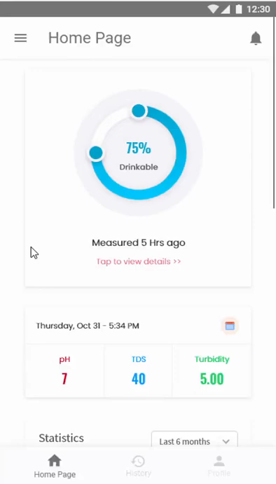

<h1 align="center">Water Testing Instant (WTI)<h1>
  
## About

Water Testing Instant (WTI) is one project of the LMAN team in FPT Edu Hackathon 2019.

This repository contains embedded code. View the [Mobile implementation](https://github.com/hoangtrungnguyen/WaterTestingInstant) and [WTI Backend](https://github.com/DAN3002) 

  
   

## [Prototype](https://youtu.be/hAtyMoNhch8)

Support ESP32 and ESP8266

- [version 1](https://youtu.be/I5SfC1utAxE)
- [version 2 (final):](https://youtu.be/U8-fJH5Vw60)

